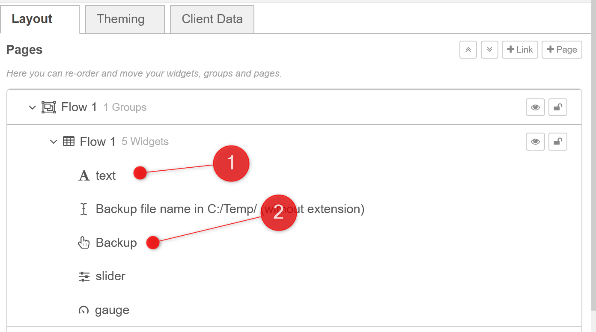

<h1 align="left">
  <br>
  
  <br>
  Industrial Automation Base
  <br>
</h1>

Course AutB

Author: [Cédric Lenoir](mailto:cedric.lenoir@hevs.ch)

# LAB 07 Node-RED

## Preamble
Node-RED is considered as a low-code/no-code tool.

Low-code and no-code refer to software development approaches that minimize or eliminate the need to write traditional programming code:

**Low-code**: Platforms provide visual tools, like drag-and-drop editors and pre-built components, but still allow users to write some code for custom logic. This approach is aimed at developers who want to build applications faster and with less manual coding.

**No-code**: Platforms are designed so users can build applications entirely through visual interfaces, configuration, and logic flows—without writing any code at all. This is targeted at non-programmers or business users.

Node-RED is considered a **low-code**/**no-code** tool because you can create complex workflows by connecting nodes visually, but you can also add custom JavaScript code if needed. This makes it accessible to both beginners and experienced developers.

> In reality, for a real application, it will be necessary to write code, but an engineer could develop nodes to allow a non-engineer to write or modify an application without writing any code. This is the great advantage of Node-RED: **it allows you to deliver a customizable application**.

> Another feature of Node-RED is its complementarity with a PLC. If a PLC with IEC 61131-3 is highly efficient for cyclic tasks, **it is difficult to write asychronous code with a PLC**, that is exactly what Node-RED with its [Node.js](https://nodejs.org/en) can do very efficiently.

> Finally if you need to write scripts to code for a lot of computation like data science, you may prefer to use Python. [You can call a Python script from Node-RED](https://flowfuse.com/blog/2024/07/calling-python-script-from-node-red/). Node covered here.

### Résumé
-   For cyclical tasks like motion control of PID controller, use IEC 61131-3
-   For large scripts or data science, use Python.
-   For asychronous task or a user interface which is tipically an asychronous task, use Node-RED,


## Editor Guide

The editor window consists of four components:

-   The header at the top, containing the deploy button, main menu, and, if user authentication is enabled, the user menu.
-   The palette on the left, containing the nodes available to use.
-   The main workspace in the middle, where flows are created.
-   The sidebar on the right.

<div style="text-align: center;">
<figure>
    
    <figcaption>Node-RED editor window</figcaption>
</figure>
</div>

<div style="text-align: center;">
<figure>
    
    <figcaption>Node-RED editor components</figcaption>
</figure>
</div>


### Workspace
Workspace is the main space where you write your program.
You can organise your program in many sub-programs, the flows.

#### Flows
<div style="text-align: center;">
<figure>
    
    <figcaption>Node-RED flow tabs</figcaption>
</figure>
</div>

#### Nodes

Nodes can be added to the workspace by either:

-   dragging them from the palette,
-   using the quick-add dialog,
-   or importing from the library or clipboard.


Nodes are joined together by **wires** via their **ports**. A node can have at most **one input** port and **many output ports**. A port may have a label that is displayed when the mouse hovers over it. A node may specify labels, for example, the Switch node shows the rule that matches the port. The labels can also be customised in the node edit dialog.

Some nodes display a status message and icon below the node. This is used to indicate the runtime state of the node - for example, the MQTT nodes indicate if they are currently connected or not.

<div style="text-align: center;">
<figure>
    
    <figcaption>Node-RED node details</figcaption>
</figure>
</div>


#### Wires
Nodes are wired together by pressing the left-mouse button on a node’s port, dragging to the destination node and releasing the mouse button.

<div style="text-align: center;">
<figure>
    
    <figcaption>Node-RED node wire</figcaption>
</figure>
</div>

If a node with both an input and output port is dragged over the mid-point of a wire, the wire is draw with a dash. If the node is then dropped, it is automatically inserted into the flow at that point.

<div style="text-align: center;">
<figure>
    
    <figcaption>Node-RED wire slicing</figcaption>
</figure>
</div>

You can wire many wires on one input, this is because node-RED react to events. This behaviour is radically different than what could be found for example on PLC programming in IEC 61131-3.

<div style="text-align: center;">
<figure>
    
    <figcaption>Node-RED many wires on the same input</figcaption>
</figure>
</div>

#### Groups
Nodes can be joined together to form a group. They can then be moved or copied as a single object within the editor.

Groups can be given a border and background colour, as well as an optional label.

<div style="text-align: center;">
<figure>
    
    <figcaption>Node-RED group</figcaption>
</figure>
</div>

A Node-RED **group can be seen as an IEC 61131-3 action**, that is nothing more than a portion of program with a name, used for program organisation, except maybe that a group can contain variables within the group.

#### Subflows
A subflow is a collection of nodes that are collapsed into a single node in the workspace.

They can be used to reduce some visual complexity of a flow, or to package up a group of nodes as a reusable flow used in multiple places.

Once created, the subflow is added to the palette of available nodes. Individual instances of the subflow can then be added to the workspace just like any other node.

<div style="text-align: center;">
<figure>
    
    <figcaption>Node-RED subflow</figcaption>
</figure>
</div>

Subflow node can itself **only have at most one input**.

> Subflow can be seen from an IEC 61131-3 point of view as a kind of Function Block. As this lab is only an introduction to Node-RED, we do not describe subflows in details

#### Importing and exporting flow
We can import and/or export a flow as a whole project. This option, must be considered for the use of Node-RED in a real project.

### Palette
One of the strength of Node-RED is the large amount of modules. 5406 at the time this section is written.

When you start with Node-RED, there is a set of default palettes for:

-   **Common**: inject, debug...
-   **Function**: function, change...
-   **Network**: mqtt, tcp---
-   **Sequence**: split, join...
-   **Parser**: csv, json...
-   **Storage**: write file, read file

Access to new modules

<div style="text-align: center;">
<figure>
    
    <figcaption>Node-RED manage palette</figcaption>
</figure>
</div>


<div style="text-align: center;">
<figure>
    
    <figcaption>Node-RED install palette</figcaption>
</figure>
</div>

In the context of the automation course, we mainly use two imported modules:

[@flowfuse/node-red-dashboard](https://flows.nodered.org/node/@flowfuse/node-red-dashboard) is used as UI user interface. Flow Fuse is an ente

#### About FlowFuse

[FlowFuse](https://flowfuse.com/) is a company that develops Node-RED solutions, particularly to facilitate the deployment, management, and collaboration on industrial-scale Node-RED projects. FlowFuse offers tools for hosting, monitoring, and automating Node-RED instances in professional environments.

FlowFuse was founded by Nick O'Leary, who is also the principal creator of Node-RED.

[node-red-contrib-ctrlx-automation](https://flows.nodered.org/node/node-red-contrib-ctrlx-automation)

#### About ctrlX for Node-RED

The [node-red-contrib-ctrlx-automation](https://flows.nodered.org/node/node-red-contrib-ctrlx-automation) module provides integration between Node-RED and Bosch Rexroth ctrlX AUTOMATION systems. It allows Node-RED to communicate with ctrlX CORE devices, enabling you to read and write variables, exchange data, and interact with automation components over standard protocols such as OPC UA.

## Be carefull
Do not use node-red-dashboard.

#### Why not use `node-red-dashboard`?

The [`node-red-dashboard`](https://flows.nodered.org/node/node-red-dashboard) module is now considered deprecated and is no longer actively maintained. It does not receive security updates or new features. Its user interface is outdated and may have compatibility issues with recent versions of Node-RED.

Instead, it is recommended to use [`@flowfuse/node-red-dashboard`](https://flows.nodered.org/node/@flowfuse/node-red-dashboard), which is actively developed, provides a better user experience, and offers long-term support.

**Summary:**
- `node-red-dashboard` is deprecated and unmaintained.
- Security and compatibility risks.
- Prefer `@flowfuse/node-red-dashboard` for new projects.

#### More generally
-   Some palettes are edited by well established providers like Bosch Rexroth and maintened in long term. You can rely on them.

-   Some palettes are not official, like [node-red-contrib-ads-client](https://flows.nodered.org/node/node-red-contrib-ads-client), TwinCAT ADS client for Node-RED, but as the ADS protocol is stable from many years they are working very well.

-   All palettes are not Open-Source. The bad things is that you may have to pay a licence to use all the potential of theses tools. The good new is that it means that as licence means professional use of Node-RED and even if it is not free you can get support.
-   Take care about versions. If you start working for a real project you will have to trace all versions of tools used in your project. Any new version of any palette could modify the behaviour of your system.
-   Take care about security. By default, the Node-RED editor is not secured - **anyone who can access its IP address can access the editor and deploy changes**. But you can secure your system with the help of this section: [Securing Node-RED](https://nodered.org/docs/user-guide/runtime/securing-node-red). This is out of the scope of this introduction.

#### About @opcua/for-node-red

The [`@opcua/for-node-red`](https://flows.nodered.org/node/@opcua/for-node-red) module provides OPC UA (Open Platform Communications Unified Architecture) client and server nodes for Node-RED. It enables Node-RED to connect to industrial devices and systems that support the OPC UA protocol, which is widely used for secure and reliable data exchange in industrial automation.

With this module, you can:

- Connect to OPC UA servers to read and write variables.
- Subscribe to data changes and events.
- Expose Node-RED flows as an OPC UA server for integration with other systems.

This palette is actively maintained and is suitable for industrial applications where interoperability with OPC UA-enabled devices is required.

#### Last note about Siemens S7
Another example: [industrialcomm](https://flows.nodered.org/node/industrialcomm) for a Node-RED node to communicate with Siemens S7 PLCs. Copyright 2017, Hilscher Gesellschaft für Systemautomation mbH, under the MIT license. Hilscher is an established provider of communication systems for automation.

## Go !
Now we will use some nodes of Node-RED to understand some functionalities.

### Creating your first flow
Source: [Node-RED docs tutorials first flow](https://nodered.org/docs/tutorials/first-flow).

#### Overview

This tutorial introduces the Node-RED editor and creates a flow that demonstrates the Inject, Debug and Function nodes.

1. **Access the editor**

With Node-RED running, open the editor in a web browser.

If you are using a browser on the same computer that is running Node-RED, you can access it with the url: http://localhost:1880.

If you are using a browser on another computer, you will need to use the ip address of the computer running Node-RED: http://<ip-address>:1880.

2. **Add an Inject node**

The Inject node allows you to inject messages into a flow, either by clicking the button on the node, or setting a time interval between injects.

Drag one onto the workspace from the palette.

Select the newly added Inject node to see information about its properties and a description of what it does in the Information sidebar pane.

<div style="text-align: center;">
<figure>
    
    <figcaption>Node-RED inject node</figcaption>
</figure>
</div>

3. **Add a Debug node**

The Debug node causes any message to be displayed in the Debug sidebar. By default, it just displays the payload of the message, but it is possible to display the entire message object.

4. **Wire the two together**

Connect the Inject and Debug nodes together by dragging between the output port of one to the input port of the other.

5. **Deploy**

At this point, the nodes only exist in the editor and must be deployed to the server.

Click the Deploy button.

6. **Inject**

With the Debug sidebar tab selected, click the Inject button, the small square button next to your inject node. You should see numbers appear in the sidebar. By default, the Inject node uses the number of milliseconds since January 1st, 1970 as its payload.

<div style="text-align: center;">
<figure>
    
    <figcaption>Node-RED debug side bar</figcaption>
</figure>
</div>

7. **Add a Function node**

The Function node allows you to pass each message though a JavaScript function.

Delete the existing wire, select it and press delete on the keyboard.

Wire a Function node in between the Inject and Debug nodes.

Double-click on the Function node to bring up the edit dialog. Copy the following code into the function field:

```js
// Create a Date object from the payload
var date = new Date(msg.payload);
// Change the payload to be a formatted Date string
msg.payload = date.toString();
// Return the message so it can be sent on
return msg;
```

Click Done to close the edit dialog and then click the deploy button.

Now when you click the Inject button, the messages in the sidebar will now be formatted is readable timestamps.

#### Summary

This flow demonstrates the basic concept of creating a flow. It shows how the Inject node can be used to manually trigger a flow, and how the Debug node displays messages in the sidebar. It also shows how the Function node can be used to write custom JavaScript to run against messages.

---

### About messages
As an engineer you have to understand that a Node-RED flow works by passing messages between nodes. The messages are simple JavaScript objects that can have any set of properties.

**Source**: [Understanding Node-RED Messages](https://flowfuse.com/node-red/getting-started/node-red-messages/)

Node-RED relies on passing messages between nodes to build dynamic IoT, automation, and data-processing workflows. Each message carries data that nodes modify, process, or analyze, so understanding how these messages are structured and handled is crucial. Mismanaging messages can lead to subtle bugs, such as overwriting data, infinite loops, or crashes. To prevent errors and build reliable flows, it’s essential to know how to work with messages efficiently.

In this guide, we’ll explore the inner workings of Node-RED messages, common mistakes, and best practices for ensuring smooth data flow without errors.

#### What Are Node-RED Messages?

In Node-RED, messages are packets of data that travel between nodes in your flow. Node-RED is event-driven, meaning an event emitter triggers events, and a listener reacts to them. In this context, nodes in Node-RED act as both event emitters and listeners, with messages serving as the medium through which these events are communicated. These messages represent the information that nodes read, modify, and act upon. Each node processes these messages and passes them along to the next node in the sequence.

<div style="text-align: center;">
<figure>
    
    <figcaption>Node-RED passing messages</figcaption>
</figure>
</div>

Messages are crucial because they carry the data that powers your workflows—whether it’s sensor readings, user inputs, or responses from an API. Essentially, Node-RED messages are JavaScript objects, which are simple yet powerful structures for managing and transferring data throughout your flows.

#### Understanding JavaScript Objects

A JavaScript object is a data structure used to store multiple values in a single variable. It consists of key-value pairs, where each key, or property, is associated with a specific value. This organization allows you to group and access related data easily.

For example:
```js
{
  name: "Bob",
  age: 24,
  married: true
}
```

In this example, **name**, **age**, and **married** are properties of the object. Similarly, Node-RED messages use this structure to organize and transport data within your flows.

#### Try it !
Add a new function in your first flow and send a structured parameter to the debug sidebar.

```js
// Create Pack Parameter
msg.payload = {
    ID: 1101,
    Name: "Axis X Acceleration",
    Unit: "m/s2",
    Value: 9.81
};

// Return the new payload of message
return msg;
```

You should be able your complete parameter
<div style="text-align: center;">
<figure>
    
    <figcaption>Node-RED debug object</figcaption>
</figure>
</div>

> In this course with version V1.20 of the software in CtrlX Core, it is still not possible to send dirctly IEC 61131-3 STRUCT in Node-RED. This is possible with the new version or, for example with a Beckhoff.

#### Comparison: IEC 61131-3 STRUCT vs JavaScript Object

| Feature                | IEC 61131-3 STRUCT                                 | JavaScript Object                          |
|------------------------|----------------------------------------------------|--------------------------------------------|
| Definition Syntax      | `STRUCT ... END_STRUCT`                            | `{ ... }`                                  |
| Example                | <pre>TYPE MyStruct : STRUCT<br>  ID : INT;<br>  Name : STRING;<br>  Value : REAL;<br>END_STRUCT<br>END_TYPE</pre> | <pre>{<br>  ID: 1101,<br>  Name: "Axis X Acceleration",<br>  Value: 9.81<br>}</pre> |
| Data Types             | Strongly typed (INT, STRING, REAL, etc.)           | Dynamically typed                          |
| Field Access           | `myStruct.ID`                                      | `myObject.ID`                              |
| Mutability             | Fields can be updated                              | Properties can be updated                  |
| Nesting                | Supports nested STRUCTs                            | Supports nested objects                    |
| Usage Context          | Industrial automation (PLC programming)            | Web, server, and general programming       |
| Serialization          | Not natively supported (requires conversion)       | Native support (e.g., `JSON.stringify`)    |
| Language               | IEC 61131-3 (PLC languages)                        | JavaScript                                 |

#### Anatomy of Node-RED Messages

In Node-RED, messages are by default referred to as msg, and nodes are designed to work with this naming convention.

Node-RED messages consist of several key properties essential for data handling and communication between nodes:

-   msg.**_msgid**: A unique identifier for the message, automatically assigned by Node-RED. It helps in tracking and debugging messages within the flow.
-   msg.**payload**: This is the primary data of the message. It contains the main information that nodes process and act upon, such as sensor readings or user input.
-   msg.**topic**: An optional property used to categorize or identify the message. It can be useful for routing or filtering messages based on their context.

These are the most common properties you'll encounter in Node-RED, Also additional properties can be added as needed.

The _msgid property is always present, even if you send an empty object from one node to another. This property is automatically appended by Node-RED to track messages within the flow. However, it's important to note that the payload and topic properties are not always present in every message. Their inclusion depends on whether the node appends them. Most nodes in Node-RED, including contributed nodes, use the payload property as a standard for communication.

#### Data Types in Node-RED Messages

When working with Node-RED messages, it’s essential to understand the data types you'll encounter. Since messages are always JavaScript objects, the message itself must be an object, or Node-RED will throw an error.

It is possible, however, to send null as a message. This is often used when you don't want to send any data further along the flow, as null effectively stops the message from propagating to subsequent nodes.

Talking about message properties, their values can be any type of javascript supported data such as **string**, **number**, **array**, **boolean**, **object**, **buffer** and other complex datatypes.

<div style="text-align: center;">
<figure>
    
    <figcaption>Image showing the some data types that are supported by Node-RED</figcaption>
</figure>
</div>

#### Try it !

#### Comparison Table: IEC 61131-3 Base Data Types vs JavaScript Data Types

| IEC 61131-3 Data Type | Description                       | JavaScript Data Type | Example Value         |
|-----------------------|-----------------------------------|---------------------|----------------------|
| BOOL                  | Boolean (true/false)              | Boolean             | `true`, `false`      |
| BYTE                  | 8-bit unsigned integer            | Number              | `0`, `255`           |
| WORD                  | 16-bit unsigned integer           | Number              | `0`, `65535`         |
| DWORD                 | 32-bit unsigned integer           | Number              | `0`, `4294967295`    |
| LWORD                 | 64-bit unsigned integer           | Number (limited)*   | `0`, `9007199254740991` |
| SINT                  | 8-bit signed integer              | Number              | `-128`, `127`        |
| INT                   | 16-bit signed integer             | Number              | `-32768`, `32767`    |
| DINT                  | 32-bit signed integer             | Number              | `-2147483648`, `2147483647` |
| LINT                  | 64-bit signed integer             | Number (limited)*   | `-9007199254740991`, `9007199254740991` |
| USINT                 | 8-bit unsigned integer            | Number              | `0`, `255`           |
| UINT                  | 16-bit unsigned integer           | Number              | `0`, `65535`         |
| UDINT                 | 32-bit unsigned integer           | Number              | `0`, `4294967295`    |
| ULINT                 | 64-bit unsigned integer           | Number (limited)*   | `0`, `9007199254740991` |
| REAL                  | 32-bit floating point             | Number              | `3.14`, `-2.5`       |
| LREAL                 | 64-bit floating point             | Number              | `3.14159265359`      |
| STRING                | Character string                  | String              | `"Hello"`            |
| WSTRING               | Wide character string             | String              | `"Hello"`            |
| CHAR                  | Single character                  | String              | `"A"`                |
| TIME                  | Time duration                     | Number/String/Object| `1000` (ms), `"PT1S"`|
| DATE                  | Calendar date                     | String/Object       | `"2024-06-01"`, `Date`|
| TIME_OF_DAY           | Time of day                       | String/Object       | `"12:34:56"`, `Date` |
| DATE_AND_TIME         | Date and time                     | String/Object       | `"2024-06-01T12:34:56"`, `Date` |

\* JavaScript's `Number` type is a 64-bit floating point, but only safely represents integers up to 2^53-1.

---

## About static variables
Comming from the world of IEC 61131-3 it could be confusing to use only dynamic variables. **Are they static variables in Node-RED ?**

- **Yes**, *with nuance, static only when node declaring them is called at least once*.

Source: [Understanding Node, Flow, Global, and Environment Variables in Node-RED](https://flowfuse.com/blog/2024/05/understanding-node-flow-global-environment-variables-in-node-red/).

Below, only a partial set of variables are presented. Environemental variables, to store sensitive configuration data are not covered, you can [refer to the source document](https://flowfuse.com/blog/2024/05/understanding-node-flow-global-environment-variables-in-node-red/#exploring-environmental-variables) for more details.

In the same way that in IEC 61131-3 we have Global variables, program variables and Function Block variables.

### Context variables

Context variables are used to keep track of the application's state, which includes node, flow, and global variables. On the other hand, environment variables store confidential configuration information such as secret and API keys, preventing this data from being accidentally exposed in the flow.

### Exploring Global variables

Global variables in Node-RED are accessible to function, change, inject, and switch nodes within a given Node-RED instance. They serve as a centralized storage point for data that needs to be accessed across different parts of an application. **This is especially useful when you want to share data across multiple flows or tabs within the same Node-RED instance**.

For example, in a home automation system with flows for lighting, security, and climate control, global variables can store user preferences or system settings that all flows can access and update. This allows for consistent behavior across the entire system.

#### Initiating/setting Global variable

We can set Global variables using the function and change node.

In the change node, you can set it as shown in the below image


<div style="text-align: center;">
<figure>
    
    <figcaption>Set Global variable with change node</figcaption>
</figure>
</div>

<div style="text-align: center;">
<figure>
    
    <figcaption>Use Change Node</figcaption>
</figure>
</div>

Do not forger that Node-RED run only on messages, the variables of the node **Change** must receive at least one event before to write these variables in memory.

Finally, you will have to check your variables, and maybe to refresh the **context** in the sidebar.

<div style="text-align: center;">
<figure>
    
    <figcaption>Context global variables</figcaption>
</figure>
</div>

You can use javascript code in a **Function** to do the same or modify your global variable.

```js
global.set('Corner_1', 122.3);
```

#### Try that !


#### Retrieving Global variable

Retrieving global variables using change, inject, and switch nodes is quite similar. You simply need to select the "global" option and enter the variable name in the input field. Below is an image showing how you can retrieve global variables using the change node:

<div style="text-align: center;">
<figure>
    
    <figcaption>Retrieving global variable with change node</figcaption>
</figure>
</div>

or in a function with:

```js
global.get('variableName');
```

### Exploring Flow variables

Flow variables are accessible to function, change, inject, and switch nodes and some third-party nodes within the **same tab** or flow where they have been set. It is useful for sharing data within a specific flow or tab, allowing for seamless data transfer between nodes within the same flow.

For example, in a temperature monitoring system, you have multiple sensors sending data to different nodes within the same flow. You can use flow variables to pass the current temperature reading between nodes for processing and analysis within that specific flow.

You can set retrieve flow variables the same way as global variables, using the node **Change**, or javascript code.

```js
// Set a flow variable
flow.set('variableName', value);

// Get variable using its name
flow.get('variableName');
```

### Exploring Node variables

Node variables are **specific to each node** and are only visible within that node. This means we cannot read or write into that variable from outside of the node where it is initialized. This is ideal for cases where you want to store data specific to a single node, to ensure data isolation and prevent interference with other nodes

For example, You have a form on a Node-RED Dashboard 2.0, and you want to insert the submitted data into a database along with a unique ID for each submission. You can use a node variable to store and track a counter variable in the function node.

You can set retrieve node variables **only using javascript code**.

#### Initiating/setting Node variable

To initiate and set a node variable using the function node, you will have to use the context’s set method:

```js
context.set('variableName', value);
```

This action sets the value for the context variable with the specified name.

#### Retrieving Node variable

To retrieve a node variable using a function node, use the context's get method:

```js
context.get('variableName');
```

---

## File management
### Writing to a file

Here is an example to write a log on a file.
In the example, each time we press the time stamp, we increment a global variable send it to the write file node configured to write on ``C:/Temp/LogChange.json``.

<div style="text-align: center;">
<figure>
    
    <figcaption>Using write file node</figcaption>
</figure>
</div>

<div style="text-align: center;">
<figure>
    
    <figcaption>Configure write file node</figcaption>
</figure>
</div>

Below, the js code used for the function. We assume that the global variable ``Corner_1`` alredy existe in the context.

```js
// Get global var
var myPosition = flow.get('Corner_1');
// Increment and set Corener 1
flow.set('Corner_1', myPosition + 1);

// Get date
var thisDate = Date();
// Get GMT
var idGMT = thisDate.indexOf("GMT");
// Format date
var LogDate = thisDate.slice(0, idGMT - 1);

// Concat Corner_1 to LogDate
msg.payload = LogDate.concat(": ", myPosition);

return msg;
```

### Try that !

> This example show how it could be easy to build a log file to trace any change from the application. It will be more clear when using the Flowfuse user interface.

#### Try to write an array

-   Now you can modify the code to write a small array of two values.
-   Note that by default, Node-RED use a JSON file format.
-   Note that in the write file node, you can select if you want append the values or overwrite the file.


```
var NewMsg = [];
NewMsg[0] = global.get('Corner_1');
NewMsg[1] = global.get('Corner_2');

msg.payload = NewMsg;

return msg;
```
**JSON**, JavaScript Object Notation, is a lightweight data-interchange format. It is easy for humans to read and write, and easy for machines to parse and generate. JSON is commonly used to store and exchange data between servers and web applications.

Key features:

Data is represented as key-value pairs.
Supports objects ({}), arrays ([]), strings, numbers, booleans, and null.
Syntax is similar to JavaScript object literals.

Example:
```js
{
  "name": "Alice",
  "age": 30,
  "hobbies": ["reading", "cycling"]
}
```
In Node-RED, data is often stored and transferred in JSON format for compatibility and ease of use.

#### Try it !
Try to write the example in a json file.

---

### Reading from a file
In this last example, we will read a simple set of an array of two values from a json file, for example [33,44].

We use this example to introduce the notion of many outputs for a node, here, two outputs for a **function**.

<div style="text-align: center;">
<figure>
    
    <figcaption>Read a json file</figcaption>
</figure>
</div>

In this case, we want to split the two values of the file in two different messages. Configure the function with two outputs

<div style="text-align: center;">
<figure>
    
    <figcaption>Function with two outputs</figcaption>
</figure>
</div>

Configure the read file node with an absolute path

<div style="text-align: center;">
<figure>
    
    <figcaption>Read the json file</figcaption>
</figure>
</div>

Configure the json node

<div style="text-align: center;">
<figure>
    
    <figcaption>Edit the json file</figcaption>
</figure>
</div>

Finally, the code of the function, we build two messages for two differents outputs.

```js
var msg_1 = { payload: msg.payload.length };
msg_1.payload = msg.payload[0];

var msg_2 = { payload: msg.payload.length };
msg_2.payload = msg.payload[1];

return [msg_1, msg_2] ;
```

---

## Reading your first variable from PLC
We use two nodes of the ctrlX Automation palette.

<div style="text-align: center;">
<figure>
    
    <figcaption>CtrlX automation nodes</figcaption>
</figure>
</div>

The essential difference between these two nodes is that the **Data Layer Request** is waiting for an event on Node-RED to start an action, for example to read or write. While the second **Data Layer Subscribe**, is a subscrption to any data change from the data layer. The event is triggered by data change only. 

We will use the subscription to read data change from the PLC and request a write to modify the data on PLC side.

Note that: at least one the ctrlX automation node must be configured with:
-   The **IP address** of the PLC, here: ``192.168.0.200``.
-   The **username** of the PLC, here: ``boschrexroth``.
-   The **password** of the PLC, here: ``boschrexroth``.

To access a PLC data, the variable must have been configured in read/write access in the **Symbols of CtrlX PLC IDE**.

The Path of the variable can be discovered using a tree. The data type are not these of the PLC, but from the **CtrlX Data Layer**.

### Data Type Comparison: ctrlX Data Layer vs IEC 61131-3 vs Node-RED

| ctrlX Data Layer Type | IEC 61131-3 Type      | Node-RED / JavaScript Type | Example Value           | Notes                                      |
|----------------------|-----------------------|----------------------------|------------------------|--------------------------------------------|
| bool                 | BOOL                  | Boolean                    | `true`, `false`        |                                            |
| int8                 | SINT                  | Number                     | `-128`, `127`          | 8-bit signed integer                       |
| uint8                | USINT                 | Number                     | `0`, `255`             | 8-bit unsigned integer                     |
| int16                | INT                   | Number                     | `-32768`, `32767`      | 16-bit signed integer                      |
| uint16               | UINT                  | Number                     | `0`, `65535`           | 16-bit unsigned integer                    |
| int32                | DINT                  | Number                     | `-2147483648`, `2147483647` | 32-bit signed integer                 |
| uint32               | UDINT                 | Number                     | `0`, `4294967295`      | 32-bit unsigned integer                    |
| int64                | LINT                  | Number (limited)*          | `-9007199254740991`, `9007199254740991` | 64-bit signed integer (JS safe up to 2^53-1) |
| uint64               | ULINT                 | Number (limited)*          | `0`, `9007199254740991`| 64-bit unsigned integer (JS safe up to 2^53-1) |
| float32              | REAL                  | Number                     | `3.14`, `-2.5`         | 32-bit floating point                      |
| float64              | LREAL                 | Number                     | `3.14159265359`        | 64-bit floating point                      |
| string               | STRING                | String                     | `"Hello"`              | UTF-8 encoded                              |
| array                | ARRAY                 | Array                      | `[1, 2, 3]`            |                                            |
| object               | STRUCT                | Object                     | `{ key: value }`       |                                            |
| enum                 | ENUM                  | String/Number              | `"StateA"`, `1`        | Represented as string or number in JS      |
| timestamp            | DT, DATE_AND_TIME     | String/Date                | `"2024-06-01T12:34:56"`| ISO 8601 string or JS Date object          |
| byte                 | BYTE                  | Number                     | `0`, `255`             | 8-bit unsigned integer                     |
| ...                  | ...                   | ...                        | ...                    | ...                                        |

\* JavaScript's Number type safely represents integers up to 2^53-1.

---
## UI Dashboard

<div style="text-align: center;">
<figure>
    
    <figcaption>One group in a page with  widgets</figcaption>
</figure>
</div>

### About FlowFuse Dashboard 2.0

FlowFuse Dashboard 2.0 (also known as Node-RED Dashboard 2.0) is a modern, actively maintained user interface framework for Node-RED, developed by FlowFuse. It enables you to build interactive dashboards for visualizing and controlling your Node-RED flows. Dashboard 2.0 offers a responsive design, improved widget library, and better integration with Node-RED’s event-driven architecture. It supports real-time updates, customizable layouts, and is designed for long-term support and compatibility with current Node-RED versions. For more information, see the [official documentation](https://flowfuse.com/docs/dashboard/).

<div style="text-align: center;">
<figure>
    
    <figcaption>Five groups in a page with a lot of widgets</figcaption>
</figure>
</div>

You can now use button nodes and text nodes in place or in parallel of the different functions tested in the first part.

Flow fuse layout, see sidebar.

<div style="text-align: center;">
<figure>
    
    <figcaption>Configure dashboard layout</figcaption>
</figure>
</div>

-   Each page can be configured as a tab in the browser when UI is started.
To contain **widgets**, button and text nodes are examples of widgets, **a page must contain at least one group**.

-   The widgets can be ordered in the group.
-   The Flows are totally independants of the pages. That is, you can link any node of the dashboard to any group.  

<div style="text-align: center;">
<figure>
    
    <figcaption>Widgets in a group</figcaption>
</figure>
</div>

But you must select the group where you want to display the widget.

<div style="text-align: center;">
<figure>
    
    <figcaption>Display slider in a group</figcaption>
</figure>
</div>

## URS
-   Ideally we want to use widgets to modify parameters in the PLC.
-   We want to save parameters in a file
-   We want to restore parameters from a file
    We want to log any input change in a file, see : **link in** and **link out**. nodes.

Not finished.

|URS ID |Specification|
|-------|-------------|
|0. |Starting|
|0.1   |Dans cet état, les axes X et Z vont se positionner aux positions **X = -100** et **Z = 100**.|
|0.2   |Quand les deux axes sont en position, on passe en Execute.|


|Id |Move To Position X|M.T.P Z |Action      |Delay [ms] |Next Id|
|---|------------------|--------|------------|-----------|-------|
|1  |0                 |50      |eOpen       |500        |2      |
|2  |0                 |-50       |eClose      |0          |3      |
|3  |100               |-50       |eOpen       |0          |4      |
|4  |100               |50      |eClose      |0          |1      |
|1  |0                 |50      |eOpen       |500        |2      |

-  Velocity_m_s        := 0.05;
-  Acceleleration_m_s2 := 1;
-  Jerk_m_s3           := 10;

<div style="text-align: center;">
<figure>
    
    <figcaption>2D motion with a square</figcaption>
</figure>
</div>


